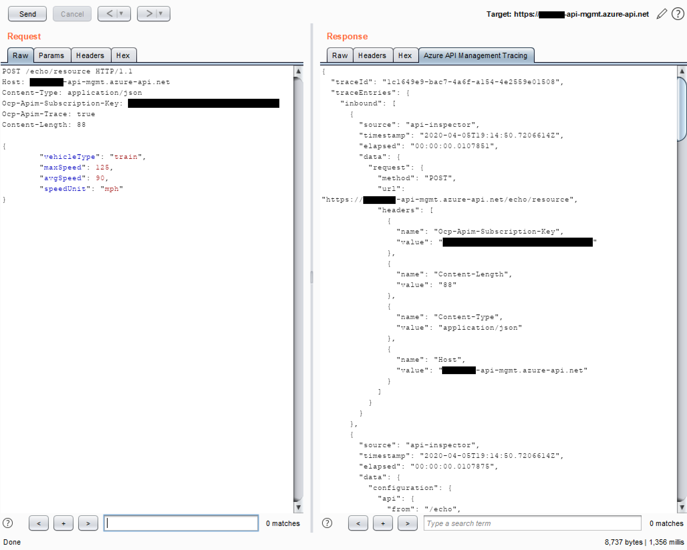

# Azure API Management Tracing Helper

Burp extension to show Azure API Management [tracing](https://docs.microsoft.com/en-us/azure/api-management/api-management-howto-api-inspector) output inside Burp.

## Screenshots

The "Azure API Management Tracing" tab shows pretty-printed tracing data.

Issues are created when tracing is identified.
